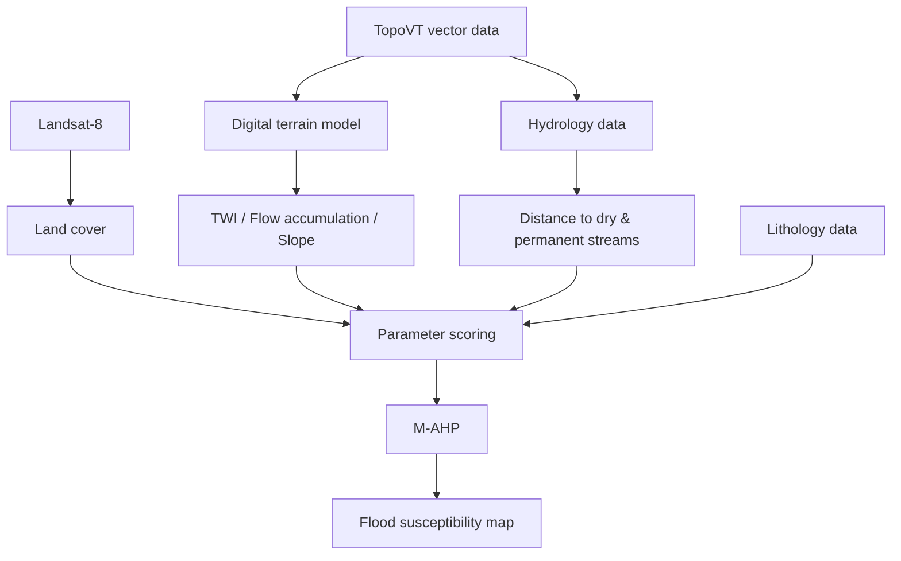

# Flood Susceptibility Map (M-AHP, 2015)

An interactive web map of flood susceptibility for the Ankara region. A susceptibility
raster produced with the **Modified Analytic Hierarchy Process (M-AHP)** is converted into
a single static [PMTiles](https://docs.protomaps.com/pmtiles/) vector tile archive and
served with [MapLibre GL](https://maplibre.org/) — no tile server or backend required.

> Based on the academic study:
> [Sozer, B., Kocaman, S., Nefeslioglu, H. A., Firat, O., and Gokceoglu, C.: PRELIMINARY INVESTIGATIONS ON FLOOD SUSCEPTIBILITY MAPPING IN ANKARA (TURKEY) USING MODIFIED ANALYTICAL HIERARCHY PROCESS (M-AHP), Int. Arch. Photogramm. Remote Sens. Spatial Inf. Sci., XLII-5, 361–365, https://doi.org/10.5194/isprs-archives-XLII-5-361-2018, 2018.](https://isprs-archives.copernicus.org/articles/XLII-5/361/2018/)

## How the susceptibility map was generated (M-AHP)

The susceptibility raster (`data/mAHP_2015_son_dp5_clip.tif`) was produced in the study
above. Several flood-conditioning factors are scored and combined with M-AHP; see the
paper for the full methodology, factor weights, and validation.



## Web-map pipeline

This repository starts from the produced raster and turns it into a web map in three steps:

```
clip.tif  ──(1)──>  data/sel.geojson  ──(2)──>  docs/sel.pmtiles  ──(3)──>  GitHub Pages
 (UTM 36N)          (WGS84, class 1-5)          (vector tile)               (MapLibre)
```

| Stage | Script | Output |
|-------|--------|--------|
| 1. Classify + polygonize + reproject | `scripts/classify_polygonize.py` | `data/sel.geojson`, `data/breaks.json` |
| 2. Vector tiles | `scripts/build_pmtiles.ps1` (Docker tippecanoe) | `docs/sel.pmtiles`, `docs/breaks.json` |
| 3. Publish | GitHub Pages | live map |

## Requirements

- **Python 3.10+** — runs the classification/polygonization step.
- **Docker** — runs `tippecanoe` (no native Windows build) to make the vector tiles.
- **Node.js** — only for local preview (`npx serve`).

You do **not** need GDAL on `PATH`, a GIS desktop app, or a tile server.

## Setup (one-time)

```powershell
python -m venv .venv
.\.venv\Scripts\pip install -r requirements.txt
# tippecanoe has no native Windows build -> build a local Docker image:
docker build -t tippecanoe-local -f scripts/tippecanoe.Dockerfile .
```

## Build the map

### 1. Classify + polygonize + reproject

`scripts/classify_polygonize.py`:
- Assigns the UTM 36N (EPSG:32636) CRS to the raster (from the `.tfw` + boundary shapefile `.prj`).
- Splits the continuous mAHP values (~3.91–45.93) into 5 classes using **Jenks natural breaks**.
- Removes speckle with `sieve` (merges noise into the neighboring class).
- Polygonizes connected same-class cells and reprojects UTM 36N → WGS84.
- Produces `data/sel.geojson` (each feature has a `class` 1–5) and `data/breaks.json`.

```powershell
.\.venv\Scripts\python scripts/classify_polygonize.py
```

### 2. GeoJSON → PMTiles

`scripts/build_pmtiles.ps1` runs tippecanoe in Docker with
`-l susceptibility --coalesce --reorder --drop-densest-as-needed -Z6 -z14`, producing
`docs/sel.pmtiles` (~8.5 MB) and copying `breaks.json` into `docs/`.

```powershell
pwsh scripts/build_pmtiles.ps1
```

### 3. Publish (GitHub Pages)

- Commit `docs/index.html`, `docs/sel.pmtiles`, and `docs/breaks.json`.
- GitHub repo → **Settings → Pages → Deploy from a branch** → branch `main`, folder `/docs`.
- GitHub Pages supports HTTP range requests, so PMTiles works without a server, and
  `sel.pmtiles` (~8.5 MB) is well below GitHub's 100 MB file limit.

## Local preview

Python's `http.server` does **not** support range requests (which PMTiles needs); use a
range-capable server:

```powershell
npx serve docs -l 8765
# http://localhost:8765
```

## The map

`docs/index.html` is a self-contained page (MapLibre GL + pmtiles from CDN, keyless CARTO
basemap). It colors the polygons green→red by the `class` (1–5) attribute and builds the
legend and initial view (`fitBounds`) from `breaks.json`.

### Susceptibility classes (Jenks, 2015)

| Class | mAHP range    | Susceptibility | Color     |
|-------|---------------|----------------|-----------|
| 1     | 3.91 – 10.75  | Very low       | `#1a9850` |
| 2     | 10.75 – 16.99 | Low            | `#a6d96a` |
| 3     | 16.99 – 22.02 | Medium         | `#fee08b` |
| 4     | 22.02 – 28.00 | High           | `#fdae61` |
| 5     | 28.00 – 45.93 | Very high      | `#d73027` |

## Project structure

```
data/                          Source raster (+ .tfw world file) and study-area boundary
docs/                          Published site: index.html, sel.pmtiles, breaks.json
scripts/
  classify_polygonize.py       Raster -> classified WGS84 polygons + breaks.json
  build_pmtiles.ps1            GeoJSON -> docs/sel.pmtiles (Docker tippecanoe)
  tippecanoe.Dockerfile        Builds the local tippecanoe-local image
requirements.txt               Python dependencies
```

## Notes

- The source raster has no embedded CRS; positioning comes from the `.tfw` world file
  (UTM Zone 36N / EPSG:32636, 10 m pixels, Ankara region).
- `data/sel.geojson` (~80 MB intermediate output) and `.venv/` are git-ignored.
